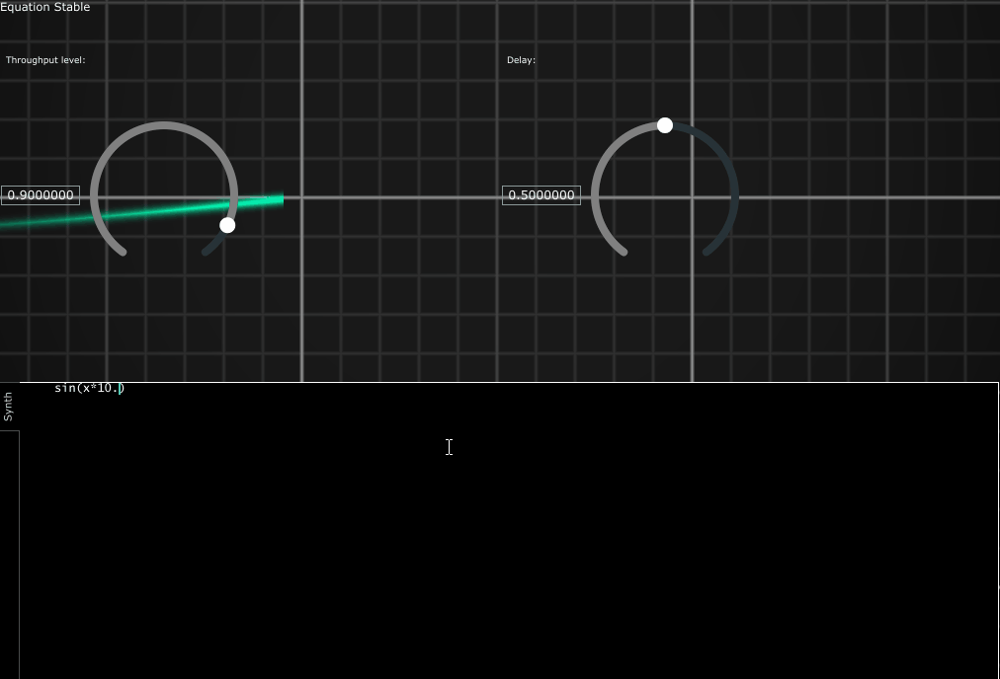

# cypher VST

## Sound Design & Equations
Equations typed in to the editor directly create the waveform.

#### Future work
I'm in the middle of getting a nice save and load up and running, would be simple if not for some issues with VST and Ableton that don't crop up with VST3, also been planning on making a layering process for different equations.

##### Requirements
-- Windows
-- CMake
-- Opengl

##### Libraries
[Juce Framework](https://github.com/juce-framework/JUCE)
[Exprtk]( https://github.com/ArashPartow/exprtk)

##### EXT Dependencies
 VST3_SDK
 vstsdk2.4
