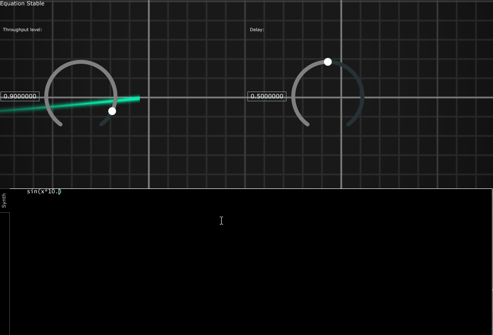

# cypher VST

## Sound Design & Equations
This is a VST I have been working on called cypher using JUCE and exprtk.
Equations typed in to the editor directly create the waveform.
No fancy knobs and buttons, no routing the idea is to keep it simple.

#### Future work
I'm in the middle of getting a nice save and load up and running, would be simple if not for some issues with VST and Ableton that don't crop up with VST3, also been planning on making a layering process for different equations.

##### Requirements
-- Windows
-- CMake
-- Opengl

##### Libraries
[Juce Framework](https://github.com/juce-framework/JUCE)
[Exprtk]( https://github.com/ArashPartow/exprtk)
